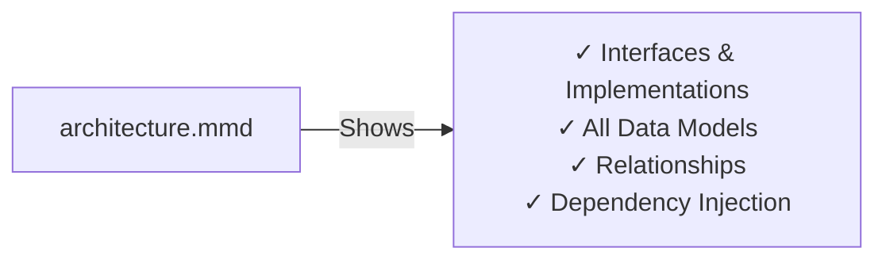

# 📊 UML Comparator - Mermaid Architecture Diagrams

This folder contains comprehensive Mermaid diagrams documenting the **UML Comparator System** - a Go-based tool for automatically comparing and grading UML diagrams.

---

## 📁 Diagram Files

### 1. **architecture.mmd** - Class Diagram
**Purpose**: Shows all interfaces, classes, and their relationships  
**What's shown**:
- All module interfaces (IFileParser, IModelBuilder, IPreMatcher, etc.)
- Concrete implementations (DrawioParser, StandardModelBuilder, etc.)
- Data model classes (UMLGraph, ProcessedUMLGraph, DiffReport, etc.)
- Relationships and dependencies between classes

**Best for**: Understanding the complete system architecture and class structure



---

### 2. **processing_flow.mmd** - Data Flow Diagram
**Purpose**: Visualizes the end-to-end data processing pipeline  
**What's shown**:
- Input files (.drawio, .solution)
- Processing stages color-coded by module
- Data transformations between stages
- Output generation (CSV, HTML, GUI display)

**Best for**: Understanding how data flows through the system

---

### 3. **modules.mmd** - Module Architecture with Interfaces
**Purpose**: Shows all modules and their internal interfaces in detail  
**What's shown**:
- 8 main processing layers: Parser → Builder → PreMatcher → Matcher → Comparator → Grader → Reporter → Visualizer
- Interface definitions and their implementations
- Sub-interfaces within each module (e.g., IXMLParser, ITextSanitizer in Builder)
- 3-tier matching algorithm details
- Deep comparison strategy

**Best for**: Understanding module responsibilities and interface design

---

### 4. **components.mmd** - C4 Component Diagram
**Purpose**: System-level architecture showing components and their interactions  
**What's shown**:
- 9 major containers (Parser, Builder, PreMatcher, etc.)
- GUI and CLI layers
- File system integration
- User interaction points
- Data flow between containers

**Best for**: High-level system overview and integration points

---

### 5. **data_flow.mmd** - Data Model Transformation
**Purpose**: Shows how data structures transform throughout the pipeline  
**What's shown**:
- RawModelData → UMLGraph → ProcessedUMLGraph (student)
- RawModelData → UMLGraph → SolutionProcessedUMLGraph (OR-aware solution)
- MappingTable generation
- DiffReport creation
- GradeResult and final outputs

**Best for**: Understanding data model evolution and transformations

---

### 6. **sequence.mmd** - Sequence Diagram
**Purpose**: Shows the detailed interaction sequence for processing a submission  
**What's shown**:
- Student and solution file processing in parallel
- Function calls and data exchanges
- Each module's input/output
- Parallel processing during output generation

**Best for**: Understanding execution flow and timing

---

## 🏗️ System Layers Overview

```
┌─────────────────────────────────────────────────────────────┐
│  🖥️  GUI Layer (Lorca) / CLI Layer                          │
├─────────────────────────────────────────────────────────────┤
│  📄 Parser Module (IFileParser)                              │
│  ├─ DrawioParser (handles .drawio files)                   │
│  └─ SolutionParser (handles .solution files)               │
├─────────────────────────────────────────────────────────────┤
│  🏗️  Builder Module (IModelBuilder)                          │
│  ├─ IXMLParser (XML structure parsing)                     │
│  ├─ ITextSanitizer (HTML/entity decoding)                  │
│  ├─ ITypeDetector (UML type classification)                │
│  └─ IMemberParser (attribute/method extraction)            │
├─────────────────────────────────────────────────────────────┤
│  ⚙️  Pre-Matcher Module                                      │
│  ├─ IPreMatcher (student: simple parsing)                  │
│  └─ IUMLSolutionPreMatcher (solution: OR-aware parsing)    │
├─────────────────────────────────────────────────────────────┤
│  🔗 Matcher Module (IEntityMatcher)                          │
│  ├─ Tier 1: Architecture-based matching                    │
│  ├─ Tier 2: Fuzzy name matching (IFuzzyMatcher)            │
│  └─ Tier 3: Delta fallback (IArchAnalyzer)                 │
├─────────────────────────────────────────────────────────────┤
│  🔍 Comparator Module (IComparator)                          │
│  ├─ Node-level comparison                                  │
│  ├─ Attribute/Method comparison (IMemberComparator)        │
│  ├─ Edge/Relationship comparison (IEdgeComparator)         │
│  └─ Type compatibility (ITypeAnalyzer)                     │
├─────────────────────────────────────────────────────────────┤
│  ⭐ Grader Module (IGrader)                                  │
│  └─ Calculates scores, penalties, and feedback             │
├─────────────────────────────────────────────────────────────┤
│  📊 Reporter Module (IReporter)                              │
│  ├─ CSVReporter (batch output)                             │
│  └─ ConsoleReporter (console output)                       │
├─────────────────────────────────────────────────────────────┤
│  🎨 Visualizer Module (IVisualizer)                          │
│  └─ HTMLVisualizer (self-contained HTML with SVG icons)    │
└─────────────────────────────────────────────────────────────┘
```

---

## 🔑 Key Design Patterns

### 1. **Dependency Inversion Principle (DIP)**
- All modules depend on interfaces, not concrete implementations
- Example: `StandardComparator` depends on `ITypeAnalyzer`, `IMemberComparator`, `IEdgeComparator`
- Enables testing with mocks and flexible implementations

### 2. **Factory Pattern**
- Parsers are created based on file extension
- Example: `GetParser(filePath)` returns appropriate parser

### 3. **Strategy Pattern**
- Different comparison strategies in Comparator
- Type analysis, member comparison, edge comparison are swappable

### 4. **Adapter Pattern**
- Builder sub-components adapt raw XML data to process
- PreMatcher adapts UMLGraph to structured objects

### 5. **Pipeline/Chain Pattern**
- Linear processing: Parser → Builder → PreMatcher → Matcher → Comparator → Grader

---

## 📊 Data Models

### Core Models

| Model | Purpose | Key Fields |
|-------|---------|-----------|
| **RawModelData** | Raw XML/JSON string | data: string |
| **UMLGraph** | Basic node/edge structure | ID, Nodes[], Edges[] |
| **ProcessedUMLGraph** | Processed student submission | ID, Nodes[], Edges[] |
| **SolutionProcessedUMLGraph** | OR-aware solution model | ID, Nodes[], ScoreConfig |
| **MappingTable** | Node correspondences | map[SolID]MappedNode |
| **DiffReport** | Detailed differences | MissingDetail, WrongDetail, ExtraDetail, CorrectDetail |
| **GradeResult** | Final grading output | TotalScore, CorrectPercent, Feedbacks[] |

### Student vs Solution Processing

**Student (ProcessedUMLGraph)**:
- 1 name per attribute/method
- Simple, straightforward parsing
- Used as-is for comparison

**Solution (SolutionProcessedUMLGraph)**:
- OR-aware: supports "A|B|C" alternatives
- Multiple acceptable names/types
- Points/scores per component
- Used as reference for grading

---

## 🔄 Processing Pipeline Steps

```
1. PARSE
   Input: .drawio, .solution files
   Output: RawModelData
   Tools: DrawioParser, SolutionParser

2. BUILD
   Input: RawModelData
   Output: UMLGraph (nodes + edges)
   Tools: StandardModelBuilder (IXMLParser, ITextSanitizer, ITypeDetector, IMemberParser)

3. PRE-MATCH (Parallel)
   Student: UMLGraph → ProcessedUMLGraph (simple parsing)
   Solution: UMLGraph → SolutionProcessedUMLGraph (OR-aware parsing)

4. MATCH (3-Tier)
   Input: ProcessedUMLGraph + SolutionProcessedUMLGraph
   Output: MappingTable
   Algorithm:
   - Tier 1: Architecture-based (analyze in/out-degree)
   - Tier 2: Fuzzy name matching (Levenshtein distance)
   - Tier 3: Delta fallback (last resort)

5. COMPARE
   Input: All processed graphs + MappingTable
   Output: DiffReport (partitioned differences)
   Compares: Nodes, Attributes, Methods, Edges, Types

6. GRADE
   Input: DiffReport + graphs + scoring rules
   Output: GradeResult (score, percent, feedbacks)
   Calculates: Penalties per difference type

7. REPORT/VISUALIZE
   Input: GradeResult
   Output: CSV, HTML, GUI display
   Tools: CSVReporter, ConsoleReporter, HTMLVisualizer
```

---

## 📈 Key Metrics

- **Total Interfaces**: 16+ major interfaces
- **Total Modules**: 8 processing modules + GUI/CLI
- **Data Models**: 20+ core structs
- **Integration Points**: 40+ public methods
- **Processing Stages**: 7 linear stages

---

## 🎯 Usage Examples

### View Architecture Diagram
```bash
# Open in VS Code Markdown Preview
# File: architecture.mmd
```

### View Processing Flow
```bash
# File: processing_flow.mmd
# Shows data movement through system
```

### Understand Module Design
```bash
# File: modules.mmd
# See all interfaces and implementations
```

### Trace a Submission
```bash
# File: sequence.mmd
# Follow how student submission is processed
```

---

## 🔗 Related Files

- **README.md** - Project overview and features
- **flow.md** - Detailed processing sequence
- **Stratergy.md** - Design strategy and decisions
- **USAGE_GUIDE.md** - User documentation
- **scheme/** - Data specification docs

---

## 📝 Diagram Legend

| Symbol | Meaning |
|--------|---------|
| `<<interface>>` | Java/Go interface |
| `<-\|-\|` | Implementation relationship |
| `-->` | Composition/Dependency |
| `-.\|>` | Association |
| `🔵` | Parser layer |
| `🟣` | Builder layer |
| `🟢` | Pre-Matcher layer |
| `🟠` | Matcher layer |
| `🔴` | Comparator layer |
| `🟡` | Grader layer |
| `🟦` | Reporter layer |
| `🎨` | Visualizer layer |

---

*Last Updated: 2024*  
*Project: UML Comparator v1.0*  
*Located in: d:\CSE\206\UML\*