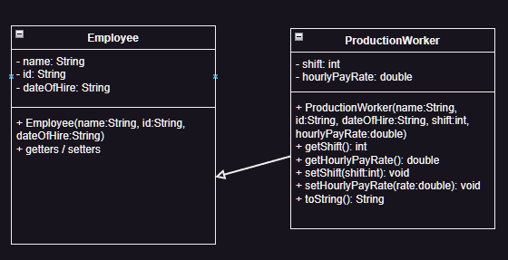
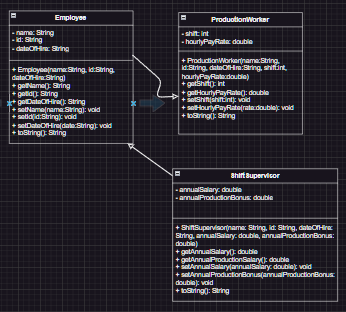
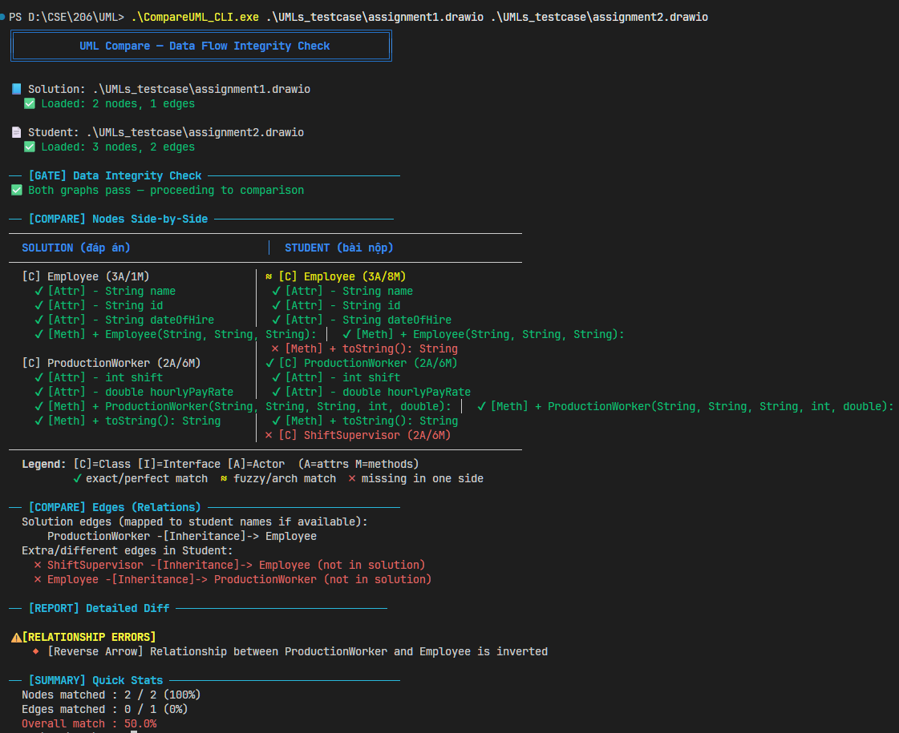

# UML Comparator — Hệ thống Chấm điểm & Đối sánh Biểu đồ UML

`UML Comparator` là công cụ mạnh mẽ được phát triển bằng **Golang**, thiết kế để tự động hóa việc chấm điểm và so khớp các biểu đồ UML được vẽ từ [draw.io](https://diagrams.net) (dưới dạng tệp `.drawio` hoặc XML) (có thể mở rộng về sau)

Dự án cung cấp khả năng so sánh chi tiết giữa bản vẽ **Đáp án (Solution)** và bài làm của **Sinh viên (Student)**, giúp phát hiện nhanh các sai sót về cấu trúc, thành phần và mối quan hệ.

---

## 🎨 Tính năng chính

### C. SVG Icons
Biểu tượng trạng thái sử dụng chuẩn Vector (SVG) để đảm bảo độ sắc nét:
- 🟢 **Correct** (Checkmark): Khớp hoàn toàn.
- 🔴 **Wrong** (Alert): Tốn tại nhưng sai thông tin.
- 🔴 **Missing** (X-Mark): Thiếu so với đáp án.
- 🔵 **Extra** (Plus): Thừa so với đáp án.

---

## 🏗️ Kiến trúc Hệ thống

Dự án tuân thủ nghiêm ngặt nguyên tắc **SOLID**, chia thành các module độc lập:

| Module | Chức năng |
| :--- | :--- |
| **Parser** | Đọc và giải mã XML từ tệp `.drawio` (Base64/Inflate). |
| **Builder** | Chuyển đổi dữ liệu XML thô thành đồ thị `UMLGraph` (String-Based). |
| **Pre-Matcher** | Tiền xử lý dữ liệu, phân loại và chuẩn hóa các thực thể (Struct-Based). |
| **Matcher** | So khớp các node giữa hai bản vẽ dựa trên độ tương đồng văn bản (Mapping). |
| **Comparator** | So sánh chi tiết thuộc tính, phương thức và các liên kết mũi tên. |
| **Grader** | Tính điểm dựa trên DiffReport: attribute/method/edge/node scoring. |
| **Visualizer** | Xuất báo cáo HTML "Dawn's Berry" với icon SVG và mã màu đồng bộ. |
| **GUI Layer** | Lớp giao diện người dùng (Lorca) giúp thao tác chọn file và xem kết quả trực quan. |
| **CLI Layer** | Lớp dòng lệnh thông minh, hỗ trợ cả tương tác (interactive) và chạy ngầm (scripting). |

---

## 📂 Cấu trúc thư mục

- `cmd/`: Chứa các tệp `main.go` cho từng công cụ (`compare`, `visualize`, `match`, `prematch`, `build`, `parse`).
- `domain/`: Định nghĩa các cấu trúc dữ liệu cốt lõi (`UMLGraph`, `DiffReport`, `GradeResult`).
- `grader/`: Module chấm điểm dựa trên DiffReport.
- `visualizer/`: Module xuất báo cáo HTML self-contained.
- `scheme/`: Tài liệu đặc tả dữ liệu giữa các module (Single Source of Truth).
- `skills/`: Hệ thống **Skill OS** dành cho AI Agent hỗ trợ phát triển dự án.
- `parser/`, `builder/`, `prematch/`, `match/`, `comparator/`: Các module chính của dự án.
---

## 📜 Tài liệu tham khảo
- [Hướng dẫn sử dụng chi tiết (GUI & CLI)](USAGE_GUIDE.md)
- [Quy trình xử lý (Flow)](flow.md)
- [Chiến lược thiết kế (Morning Dawn)](Stratergy.md)
- [Sơ đồ kiến trúc (Mermaid)](architecture.mmd)

---
# Review 
**Note**: Các file `cmd/*/main.go` là entry point gọi các module và in output. `cmd/visualize` là công cụ chính xuất báo cáo HTML. Các cmd khác (`compare`, `match`, `prematch`...) chủ yếu dùng để debug và verify từng module riêng lẻ.

## Ảnh review CLI

Ảnh review CLI

---
*Dự án được xây dựng với mục tiêu nâng cao tính minh bạch và hiệu quả trong việc giảng dạy & chấm bài môn Thiết kế Hệ thống OOP.*
